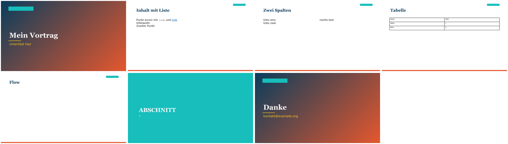

# Prototyp: Marp → editierbares PPTX auf den Layouts der Original-Vorlage

Status: **Prototyp, nicht Teil des Skills** (Roadmap M6, zurückgestellt; Entscheidung `docs/decisions/0011-pptx-export-optional.md`).
Dieses Verzeichnis hält fest, was bereits erarbeitet und am Beispiel geprüft ist, damit ein späterer Ausbau nicht bei null beginnt.
Alles hier ist synthetisch (Vorlage aus `tests/template_factory.py`); Firmenvorlagen, Layoutnamen und Platzhalterindizes gehören **nie** hierher.



## Ablauf

```
deck.md ──(node, marp-core)──▶ model.json ──(python-pptx + Vorlage + brand.json)──▶ ausgabe.pptx
          model.cjs                          build.py
```

```bash
python3 -m venv v && v/bin/pip install python-pptx          # nur für diesen Export, nicht Teil des Skills
PYTHON_PPTX=$PWD/v/bin/python docs/prototypes/pptx-export/run-demo.sh /tmp/demo   # Vorlage → Brand → Modell → PPTX → Rendering
```

Getestet mit: marp-cli 4.1.2 / marp-core 4.4.0, python-pptx 1.0.2, LibreOffice 24.2 (nur zum Rendern/Prüfen; **PowerPoint selbst nicht verfügbar**).

## Dateien
- `model.cjs` — Marp-Markdown → JSON-Modell (Folien, Direktiven, Blöcke, Inline-Läufe, Notizen, Frontmatter). `MARP_CORE=<Pfad>` oder Suche im npx-Cache.
- `build.py` — Modell → PPTX (Layouts per Klasse, Platzhalter, Listenebenen, Slots, Tabellen, Notizen).
- `demo.md` — Beispieldeck (Titel, Liste mit Unterpunkt/Link/Code, Notiz, zwei Spalten, Tabelle, nicht abbildbare Komponente, Abschnitt, Abschluss).
- `run-demo.sh` — lauffähige Gesamtdemo aus dem Repo. `ergebnis.png` — Rendering der Demo.

## Technisches Wissen

### 1. Marp-Markdown zerlegen (Node)
`new Marp({html: true}).markdown.parse(md, {})` liefert die markdown-it-Tokens **mit Marpit-Erweiterungen**; das ist dieselbe Semantik wie in Vorschau und Export.
- Folienwechsel: `marpit_slide_open` / `marpit_slide_close`; `meta.marpitDirectives` enthält die wirksamen Direktiven der Folie (z. B. `{class: "title"}`, auch lokale `_class`).
- `front_matter` (nur Folie 1): `meta` ist der YAML-Text. Eigene Felder (z. B. `author`, `date`) werden von Marp ignoriert, sind aber lesbar.
- **Notizen vs. Direktiven:** beides sind `marpit_comment`-Tokens. Direktive: `meta.marpitParsedDirectives` nicht leer. Sprechernotiz: leer.
- Listen: nur `open`/`close` zählen; Verschachtelungstiefe = Stack-Größe. Erst bei `paragraph_open` innerhalb der Liste kommt der Text (Inline-Token danach).
- Tabellen: `table_open/thead/tr/th|td`; Zelleninhalt = Inline-Token direkt nach `th_open`/`td_open`.
- Inline-Läufe: `inline.children` mit `strong_*`, `em_*`, `s_*`, `link_*`, `code_inline`, `softbreak`/`hardbreak`, `image`, `html_inline` (`<br>`).
- **Bilder:** Der Alt-Text trägt Marp-Schlüsselwörter (`w:300`, `h:`, `bg`, `left`, `right:40%`, `fit` …). Muss selbst geparst werden (Marp-CSS-Filter entfallen in PPTX).
- **Slots (`<div>` ohne Klasse):** Marp liefert `html_block`. Ein Block kann `</div>\n<div>` **zugleich schließen und öffnen** — erst das führende `</div>` entfernen, dann auf `<div>` prüfen (Fehler im ersten Wurf: zweiter Slot ging verloren).
- Alles andere in `html_block` (Komponenten wie `<div class="flow-3">`) wird als roher HTML-Block samt Klassen weitergereicht. **Rohes HTML nie in die PPTX übernehmen** (kann `file:`-Verweise enthalten; siehe 0009).
- `marp-core` kommt mit marp-cli (npx-Cache `~/.npm/_npx/<hash>/node_modules/@marp-team/marp-core`); dieselbe Suche wie bei `puppeteer-core` in `tests/`.

### 2. PPTX schreiben (python-pptx)
- `prs.slide_layouts` enthält **nur die Layouts des ersten Masters**. Alle Master durchlaufen: `{l.name: l for m in prs.slide_masters for l in m.slide_layouts}`.
- `slides.add_slide(layout)` kopiert Titel-/Inhaltsplatzhalter, **nicht Datum, Fußzeile, Foliennummer**. Nachrüsten: `slide.shapes.clone_placeholder(layout_placeholder)` und Text setzen
  (Foliennummer als Feld `<a:fld type="slidenum">`, Fußzeile aus Frontmatter `footer`). Im Prototyp **nicht** umgesetzt.
- Formatierung (Schrift, Größe, Farbe, Aufzählungszeichen, Einzug je Ebene) kommt aus dem Master; nur `paragraph.level` setzen. Nie Schrift/Größe überschreiben, sonst ist der Text nicht mehr mit dem Master verknüpft.
- Inhaltsplatzhalter in **Leserichtung** sortieren (`round(top/300000)`, dann `left`); der n-te Slot füllt den n-ten Platzhalter. Dieselbe Regel wie im CSS-Import (`> div:nth-of-type(n)`).
- Titelfolien: Untertitel-Platzhalter (`PH.SUBTITLE`); bei Abschnitt/Abschluss steht der zweite Text (Nummer, Kontakt) oft im Textplatzhalter, nicht im Untertitel.
- **Leere Platzhalter entfernen**, sonst zeigt PowerPoint „Text hier eingeben“ (`element.getparent().remove(element)`).
- Tabellen: `shapes.add_table(rows, cols, left, top, width, height)`; der Standardstil (Medium Style 2 – Accent 1) übernimmt Farben aus dem Theme (in LibreOffice als schlichtes Gitter sichtbar, in PowerPoint gestylt — ungeprüft).
- Notizen: `slide.notes_slide.notes_text_frame.text`; python-pptx legt bei Bedarf den Notizmaster an.
- **Vorhandene Folien aus der Vorlage entfernen** (Produktfall; im Prototyp nicht nötig, weil die Vorlage keine hat): Beziehung und `sldId` löschen —
  `for sldId in list(prs.slides._sldIdLst): prs.part.drop_rel(sldId.rId); prs.slides._sldIdLst.remove(sldId)`.
- Bilder: `shapes.add_picture(pfad, left, top, width)`; in Bildplatzhalter `placeholder.insert_picture(pfad)`. Umrechnung Marp-Pixel → EMU: `breite_emu / 1280` pro Pixel bei 16:9 (bei 4:3: `/ 960`), Schrift px → pt ×0.75.
  Pfade nur innerhalb des Deck-Ordners zulassen; SVG vorher in PNG wandeln (PowerPoint/python-pptx).
- Hintergrundbilder (``): als Bild im entsprechenden Seitenbereich platzieren.
- Eigene Platzhalter (Autor, Datum, Organisationseinheit …): über `placeholder_format.idx` ansprechen; Zuordnung Index → Feld in der Brand-Konfiguration (Brand-Store), Werte aus dem Frontmatter.

### 3. Layout-Zuordnung
Prototyp: `brand.json` (`layouts`, `custom_layouts`) von `marp-deck brand import`, Auflösung über den **Layoutnamen**. Für das Produkt:
- Der Import muss den **Layout-Index** speichern (`layout_indices`: Klasse → Index über alle Master in Extraktionsreihenfolge). Namen werden beim Import bereinigt (`safe_text`) und passen sonst nicht zur Vorlage.
- Name zuerst, Index als Rückfall, **harter Abbruch** bei fehlendem Layout (der Prototyp fällt still auf `content` zurück — das verdeckt Fehler).
- Den Alias-Hinweis des Imports (`closing` = „… (wie Titelfolie)“) vor der Suche entfernen.

### 4. Vorlage vorbereiten (noch nicht umgesetzt)
`skill/scripts/pptx_showcase.py` kann Folien, Notizen, Kommentare, Vorschaubild und verwaiste Medien aus einer Vorlage entfernen (Erreichbarkeitsdurchlauf) und baut je Layout eine leere Folie.
Für den Export fehlt eine Variante **ohne** Folien (`slides=False`) und zusätzlich: eingebettete Schriften entfernen (`ppt/fonts/*.fntdata` und `<p:embeddedFontLst>` in `presentation.xml`; Lizenzfrage).
Das Ergebnis läge als `template.pptx` im Brand und reist im Deck mit (nicht in `SNAPSHOT_EXCLUDE`).

### 5. Nicht abbildbare Folien → Bild als Rückfall (Stufe 1)
Rezept: `marp-cli --images png -o <tmp>/s.png <deck>.md` (mit `-c marp.config.mjs`) erzeugt `s.001.png …`; für betroffene Folien Vollbild-Bild auf ein Layout ohne Platzhalter (Typ `blank`) setzen, Alt-Text = Folientext, Notizen übernehmen,
in der Zusammenfassung nennen. Erkennung: Folie enthält `html`-Block mit Klassen (Komponente) oder nicht auflösbares Konstrukt.

### 6. Komponenten als native Formen zeichnen (Stufe 2)
Geometrie aus dem gerenderten DOM holen (Chrome + `puppeteer-core`, wie in `tests/e2e/browser-check.mjs`): je Komponentenelement `getBoundingClientRect()` relativ zum `section`
(1280×720) und `getComputedStyle` (Farben, Schrift, Rahmen) auslesen, dann Formen mit festen EMU-Positionen zeichnen. Zuordnung der bekannten Klassen:

| Komponente | PowerPoint-Formen |
|---|---|
| `box-header` + `box-body` | Rechteck (Primärfarbe) + Rechteck (hellgrau) mit Textfeld |
| `flow-header`, `flow-header-outline`, `flow-body` | Rechteck gefüllt / nur Rahmen + Rechteck mit Text |
| `flow-arrow`, `flow-vertical-arrow`, `flow-loop-*` | Verbinder/Pfeil (`MSO_SHAPE.RIGHT_ARROW`, Dreieck, gewinkelte Linie) |
| `flow-header-arrow` (Swimlane) | Fünfeck-Pfeil (`MSO_SHAPE.PENTAGON`) |
| `agenda-item` (Headline, Subline, Nummer) | zwei Textfelder + Linie |
| `accordion-*` | Zeilen aus Rechtecken (drei Spalten), Dreieck am `has-arrow` |
| `icon-matrix` | Kartenraster aus Rechtecken |
| `info-callout`, `columns-3/4` | Rechteck mit Text / Spaltenraster |
Diese Formen sind **editierbar, aber nicht mit dem Master verknüpft**. Schriftgröße so wählen, dass der Text in die Form passt; Umbrüche rechnet PowerPoint selbst.

## Bekannte Lücken des Prototyps
Keine Fußzeile/Foliennummer, keine Bilder, keine Codeblöcke, kein Bild-Rückfall, keine Komponenten, kein hartes Fehlverhalten bei fehlendem Layout, Tabellen ohne Anpassung der Höhe,
geordnete Listen ohne Nummerierung (`buAutoNum` fehlt), Unterlisten nur über `level`. Die Layouts der synthetischen Vorlage haben keine Aufzählungszeichen (Master-Eigenschaft).

## Grenzen (gelten für jeden Weg Markdown/HTML → PPTX)
- PowerPoint rechnet Zeilenumbrüche neu; in festen Formen kann der Umbruch abweichen.
- PPTX → Marp (`import-deck`) ist verlustbehaftet; PPTX ist ein Endpunkt (erst in Marp inhaltlich fertigstellen, dann exportieren).
- Ob erzeugte Dateien in PowerPoint ohne Reparaturmeldung öffnen, ist nur dort prüfbar. `python-pptx` statt eigenem XML senkt das Risiko.

## Testplan fürs Produkt
Synthetische Vorlage (`tests/template_factory.py`, Variante mit Folien und Resten): Folienanzahl, Platzhaltertexte, Notizen, Tabelle, Slots, Bild-Rückfall, harter Abbruch bei fehlendem Layout, keine Reste der Vorlagenfolien
(`SECRET`-Test wie bei `pptx_showcase`), erneutes Öffnen mit python-pptx, Rendering mit LibreOffice und Sichtprüfung; auf dem Firmenrechner zusätzlich das Öffnen in PowerPoint.
